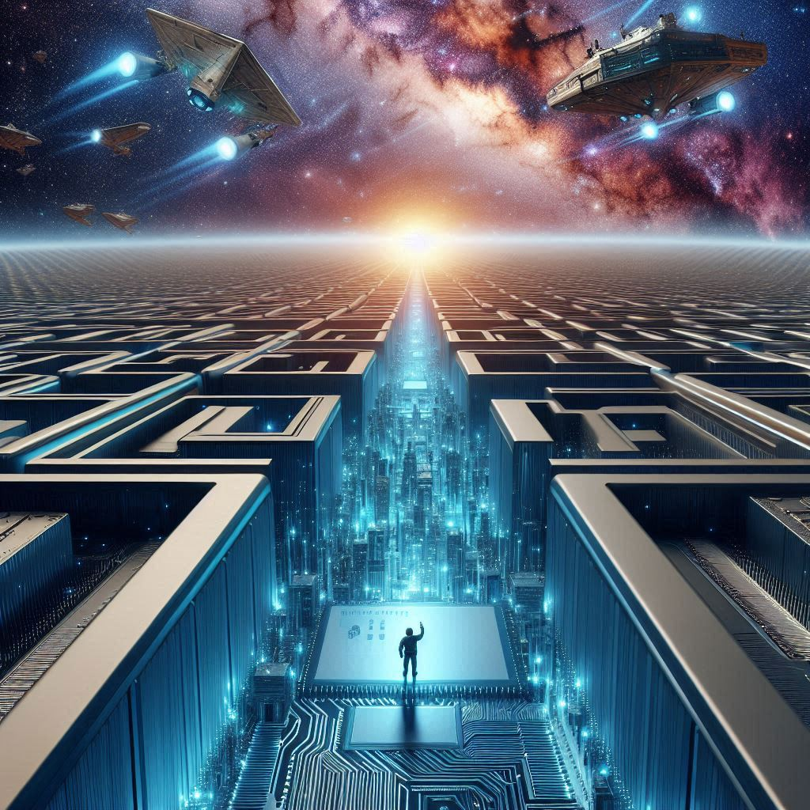

## Thank You

WOW - I am truly at loss for words. Most posts just pour out of me, but this is the toughest one to write yet. 
Over my 30 years in Amdocs I was blessed to meet so many wonderful and talented people - I will miss you all most of all!
Throughout my career I was thrilled to see people from all over the world come together and create amazing things. And especially in the last 10 month - when there are forces focused on sparking division, when my identity is challenged, it is deeply reassuring to see people of such diverse backgrounds World-Wide continue to Love and Support each other!!! My faith in humanity is forever assured!
So many feels (as youngsters say) - but most surprisingly, Guilt! I realize I am being a bit selfish in this departure from Amdocs. My love for the company runs deep, but I am comforted that there are many talented people who will carry on the torch and will deliver on all our promises! However my first and foremost love is for the amazing people of Amdocs, making my departure that much harder.
Still I know our paths will cross again as we continue to uplift humanity through technological revolution!

## Ab Initio

I was fortunate to join Amdocs while still studying at Israel's Open University. Still at the time I already had some experience working in a computer sales/service firm for several years, and later in a small 3 people startup trying to create an efficient Medical Records system for Israel and beyond.
Soon a call came in for relocation to USA to support Amdocs client on-site. It was the time of Borland C++ connected to larger servers (VMS !). One interesting challenge I remember back then was to embed Web Server screens (and APIs) into otherwise native Windows GUI C++ application. I got to tinker with HTTP protocol at TCP/IP level, to ensure APIs are dynamically activated properly in various scenarios. Another fun challenge was to develop a self-contained DLL with a lot of business logic, for mobile sales force. I started with writing reference-counting garbage collector which really made the rest of the project easy and efficient afterwards.
In 2001 Amdocs offered me an opportunity with BellSouth in Atlanta. Probably the biggest highlight there was with small 3-people innovation team that I lead. We reimagined Amdocs older Sales UI as a high-speed Adobe Flex (now Apache Flex) App, with embedded DB for offline support. UI was fluent and intuitive, which sales reps loved and were even able to show-off to their clients during the sales process.

## 3G, 4G, 5G and Beyond - AT&T Mobility

In 2009 I heard of an interesting OSS project starting at AT&T mobility (via Amdocs). I was fortunate to join and even though environment was very competitive and high-stress, the many challenges with a mix of new technologies made up for it. By that time I was already a big fan of Java, and with that opportunity we were able to push the tools to their limits. The endless challenges of ever evolving network technologies, coupled with the high-volume throughput and stability demands, really kept things interesting for the next 11 years! Probably my biggest highlight was designing and implementing a microservice with built-in DSL to support declarative network design (with some YANG similarity, but extending beyond it). The move away from imperative programming for hundreds of different past and future devices brought many benefits, among them an ability to collaborate with network experts using a common and concise template.

## Event Horizon

When people ask me how can one remain at the same company for 30 years - I always point out that Amdocs is just an Ocean of opportunities. At any time there are clients seeking additional help, so if one gets bored at specific assignment, internal move is easy enough to orchestrate.
In 2022 I decided to try my hand in something new by joining Vubiquity, one of Amdocs acquired companies. While they do many things to support Entertainment industry, my focus was around cloud-based white-label Entertainment Suite solution. Think Netflix-like solution, including Apps on various platforms, all seamlessly connecting consumers with their favorite streaming videos from Hollywood (and smaller) studios. While undoubtedly video streaming has came a long way by, it is amazing how many technological challenges remain in smooth video delivery, especially for international audiences with many languages and Ads.
As I celebrated 30 years with Amdocs, thoughts started to creep in to consider exploring what else is out there. I call this - Midlife crisis of sorts. I especially wanted to see if I can contribute to society in a more meaningful way, and perhaps give back to Open-Source community. Throughout the years I wished to give back on several occasions, but often complex licensing agreements and NDAs made it prohibitive.
I also eternally fascinated by the rapid progress in AI in recent years. I worked with neural-networks over 30 years ago in Tel-Aviv University, but felt there wasn't enough time for deeper dive into latest advancements with full-time work. My exposure while solutioning was limited, mostly as prompt engineering or integrating to existing LLMs and other models. I am fascinated and hopefully to now have the time to dive much deeper. We truly just scratching the surface with AI, especially when coupled with robotics, it will benefit humanity in incredible ways.

## Some related links to explore

- [Adi Rabinovich LinkedIn Profile](https://www.linkedin.com/in/adir1/)
- [Sense8 - We Are All Connected!](https://www.imdb.com/title/tt2431438/)
- [Event Horizon](https://en.wikipedia.org/wiki/Event_horizon)
- [Bing CoPilot AI](https://bing.com/chat)


**Images By DALL-E 3 from Microsoft Bing**


