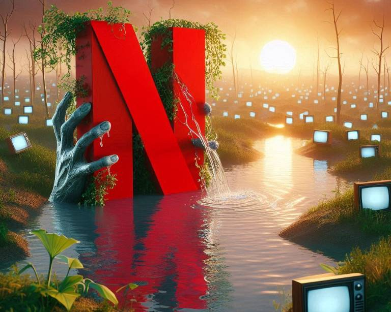

## TLDR

Netflix again cancelled several of our favorite shows, me and the family are Fuming! In this post I explore what might be Netflix decision process, and try to identify potential flaws in it. At the end I offer some solution ideas, because I like to improve things, not just complain about things.

## Netflix CEO Lying (to himself)

In a recent Interview for Bloomberg, Netflix new co-CEOs made a bold statement that "[they never cancel a successful show](https://www.forbes.com/sites/paultassi/2023/01/24/netflix-says-it-has-never-cancelled-a-successful-show/)". This statement quickly catapulted to the top of the news by itself, simply because most of Netflix subscribers vehemently disagree with it! In our household this is a common occurrence as well - consoling and supporting each other as we hear the devastating news of yet another Netflix show cancellation.
Most recently my 10 year old had this experience for the first time also, as I had to let him know that his favorite Dead End: Paranormal Park got axed. There were a lot of tears and screams of "Why!?", so I set out to explore this further. Specifically, how can it be that Netflix, which is (arguably) at the forefront of Big Data Analytics and "Data Driven Decisions", can get this so wrong?

## Big Data Is Hard

Statistical analysis is very easy to skew into "expected results". This is known as Confirmation Bias - often Data Analysts will unconciously (or even conciously) slice and aggregate their data to fit their theories. With Watching data I can see where it is infinetely harder, because people watch in so many different ways and patterns. Some bindge entire seasons, others watch episode or even part of an episode at a time - in sessions that may have days/weeks between them. Is it because show is uninteresting or because they have busy lives?
Another huge factor is Exposure - Can't watch something you never heard about! When Netflix started producing their own content - their biggest issue became making consumers Aware that show/movie exists! They didn't yet have any venue for "coming soon", there were no Ads in their own content, to cross-promote. Really they had Nothing - yet they somehow expected consumers to all Jump on new Original Content and when they didn't - conclusion "Bad Content!". I loved Sense8 and The OA, but by the time I discovered that they exist - they were Long Cancelled!
A very large factor in distorted results is incomplete or inaccurate data collection. Are they correctly collecting viewership on all devices - what if it is casting from phone to SmartTV with some exotic OS? or Nest device with a screen? And what about the all too common situation where content keeps playing long after the viewer fell asleep?
A related phenomena I saw first hand is in Ad business - most Ads, even those clicked on, are "false positives". Advertisers (on DSP) know that "exposure" data is flawed - if you start asking consumers who supposedly saw your Ads what do they remember - majority don't remember anything, not the product name nor the company name...

## Leaving Soon - Watch Now!

Another interesting debate are movies/shows that are ending their licensing agreement - this means Netflix losing access to it. Somehow Netflix thought it is best to hide such important information. This is a bit like dirty laundry - you don't want your customers to be aware that they are about to lose access. On the other hand, they may be even more distraught to discover movie disappeared from their watchlist (or stayed on the list, but unwatchable - HULU?!?). Of course executives hope that people don't even notice that their movie is now gone, but in reality many end up upset at unexpected loss.
I really wish they instead embrace the beautiful "Leaving soon, Watch Now!" warning - so favored by Tubi nowadays (to the point where shows leave just for the ratings boost, and then a bit later come back on the platform...)

## Solution Ideas

I don't claim to have all the answers, these are hard problems that will take time to solve. For starters it is important that we understand our limitations when making decisions based on data. Last thing Netflix wants is disgruntled consumers - some get so emotionally invested that they may swear-off Netflix from young age!
1. Focus on continously improving data collection, with real-world testing to confirm accuracy. All analysis is only as good as the input data it gets!
2. Don't be afraid of creative approaches to confirm assumptions. Actually ask in the app - would you like to remove this show from Continue Watching because you didn't like it?
3. Discovery is still a huge problem - find ways to show trailers even to non-Ads consumers. Offer bigger banners for new releases with some teasers. Be creative here - and ensure all analysis of popularity takes into account how "discoverable" and "promoted" this new content was in the first place! And why not have Netflix's own annual Awards show for original content - cheap enough to produce and viewers can quickly get a taste of "What's new and good" on the platform?
4. People get invested into seeing stories to conclusion - this is both Useful for content producers and a possible trap. One solution for expensive productions is to make a single-story movie (perhaps with underlaying hints for a bigger "conspiracy"), and if successful make additional movies in the same Universe/Series.
5. Consider the cost from the get-go - I am sure productions get green-light based on some sort of statitical analysis for how many subscribers like similar content and thus potential viewers. But how accurate is this - if director isn't the same, or actors differ, it can have huge impact on seemingly similar script. And what about Potential subscribers - surely Netflix needs to entice people who look at the catalog today and say "nothing interesting for me here"...

## Some related links to explore

- [Netflix Shows Cancelled in 2022](https://variety.com/lists/netflix-shows-canceled-2022/)
- [Interview with Netflix new Co-CEOs - a window into their thinking](https://www.bloomberg.com/news/newsletters/2023-01-21/netflix-ceo-reed-hastings-steps-down-interview-with-greg-peters-ted-sarandos)
- [Netflix push into video games](https://www.theverge.com/22772589/netflix-video-games-app-news-updates) - I plan to blog in the future on this Exciting effort
- [How We Decide by Jonah Lehrer](https://www.amazon.com/How-We-Decide-Jonah-Lehrer/dp/0547247990?tag=craftonia-20)
- [Predictably Irrational](https://www.amazon.com/Predictably-Irrational-Revised-Expanded-Decisions/dp/0061353248?tag=craftonia-20) - Expanded edition of the classic


**Images By DALL-E 3 from Microsoft Bing**

