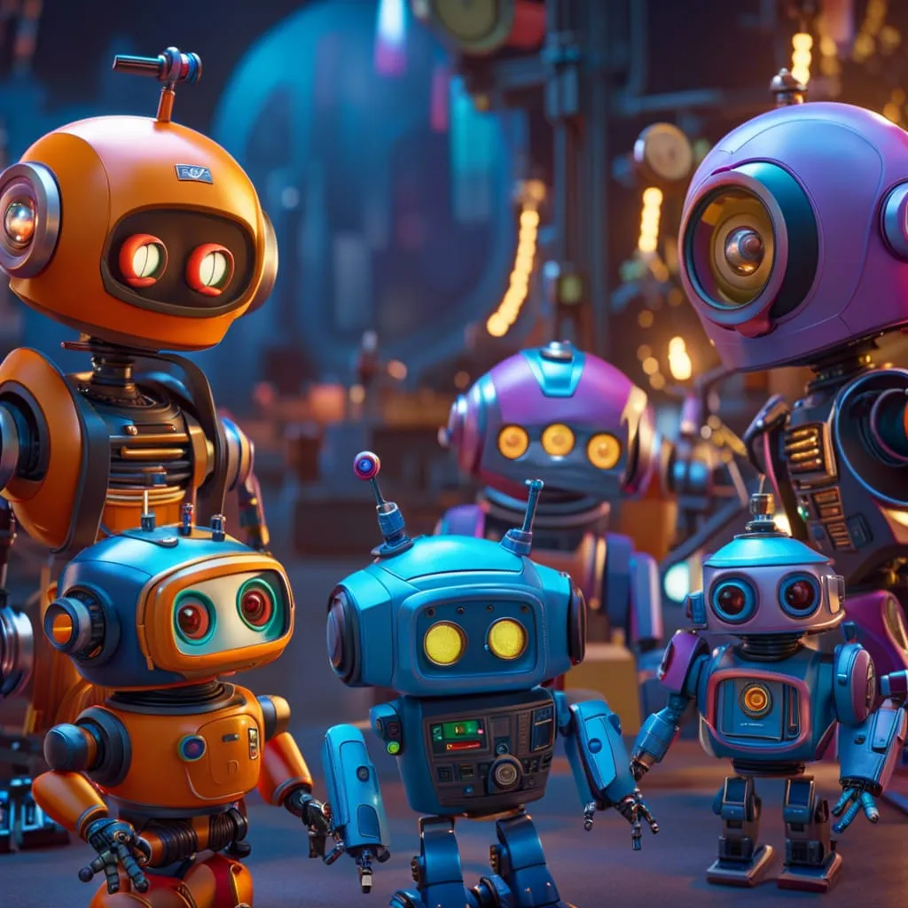

## Overview

It has been a breakthrough year in Artificial Intelligence, and many industries are already transforming. Interestingly, Seems like Google missed the importance of their own AI research! Still - I would like to argue that No Other Company Today is better positioned to replace Search with AI agents. The closest competitor, in my opinion, is Apple - although currently their AI is really struggling.

And the reason for that is - **DATA**! While this is not a surprise - I believe that Google's long standing mission to organize world information is why they have such a huge lead. Let's dive in!  

## AI Agents - Is that not what we already have?

Key difference in evolution from current AI to proper Agents is Context and Executive Function. Today even the "simple" ability to recall relevant context of our "conversations" with Gemini or Claude represent major challenge for the industry. Proper Agent needs to retain All Key Elements of "conversational awareness" separating long-term and short-term context, as well as accounting for exceptions and evolution.

Even more distant is safe and effective Executive Function - Where we will all be confident enough to let AI Agent actually Buy our flights, or even filter down to top 3 hotel options (explaining key Relevant differences) - to stay with a Travel Agent example.

## Google Search, AI Agents and the Path Forward

Although Google made most significant AI investments over the last 15+ years, they managed to fumble them also, as I believe no company is immune to the famous [Market Cannibalism Conundrum](https://www.investopedia.com/terms/c/corporatecannibalism.asp#:~:text=Corporate%20cannibalism%20is%20when%20a,product%2C%20therefore%20reducing%20overall%20sales.) (More on this under a Tangent below).

It is important to understand that LLMs are modeled after human-brain, and as such - they exhibit similar limitations best described by Kahneman in [Thinking, Fast and Slow](https://en.wikipedia.org/wiki/Thinking,_Fast_and_Slow). In other words - LLM has access to "basic facts" about our world, but no access to detailed, real-time, numerical and a lot of other Data about the NOW.

This is where [RAG](https://cloud.google.com/use-cases/retrieval-augmented-generation?hl=en) and [RIG](https://blog.google/technology/ai/google-datagemma-ai-llm/) come in, but even more so, advanced AI agent should be able to dynamically activate ANY external API! In other words - combination of Core Intelligence with Access to World's (Real-Time) Information opens up the most exciting possibilities.

Real World Example: You will be able to ask Google AI to "Schedule an appointment with Best Local Children's Eye doctor that takes our insurance and has earliest available appointment!". AI Agent will be able to understand the natural language request, and then access Local Doctors, their ratings, specialties, insurance acceptance And eventually schedule via real-time Appointments API! What I am arguing is that No Other Company is closer to being able to access/obtain so much information about our "Real-World" except Google. Many others can try to implement something similar, but even so will remain at the mercy of [Google APIs speed/cost](https://www.forbes.com/sites/barrycollins/2023/06/01/death-by-api-reddit-joins-twitter-in-pricing-out-apps/).

## Tangent: Ride the "Google Wave" - or NOT

The subtitle is of course referring to the famous [Google Wave](https://en.wikipedia.org/wiki/Google_Wave) innovation, which undoubtedly was ahead of it's time. Many of us recall that Google used to be in constant innovation mode, but over time they realized that some "Mistakes" have much higher cost than others. Whenever products (remember Google+?) or major technology frameworks get retired, the company started to realize that it may be hurting their brand to **Market-Test** New Innovative Ideas. Many people (especially important early-adopters) are susceptible to emotional scarring from discontinued tech, which ultimately accumulates. That probably deserves a whole separate post, but the reason I bring it up here is because I suspect this was the main factor stifling AI progress at Google during the (critical) 10+ recent years.

My sense is that they got rude awakening in 2023/24 and finally managed to Ease the internal guard-rails blocks, which is another critical Factor that should make Google better positioned in this battle. Their enormous pace of [innovative releases in 2024](https://blog.google/products/gemini/google-gemini-ai-collection-2024/) I believe is actual evidence that they managed to (correctly IMHO) outgrow their **Brand-Trauma**.

## Apple Agent still MIA (Siri team struggles)

It is not a secret that [Siri has struggled](https://news.ycombinator.com/item?id=16588645) for years. I suspect current sad state of affairs with Apple AI is a result of the same team leading the effort - they really need a refresh (Call me?) there! Now to be more specific - While I Applaud [Apple's pioneering efforts in AI Privacy](https://security.apple.com/blog/private-cloud-compute/), I am not sure the resulting delay in bringing AI to the masses was worth it during such a critical juncture of our civilizational entry into the AI Age.

## Another Tangent: Technology Positioning

While Market Positioning for a Brand seem to be a well defined metric, what I am referring to here is more of a Technology positioning indicators. In other words - there are serious Platform Migration hurdles consumers need to overcome, and as they develop habits and expectations, sprinkled with brand loyalty, this barrier grows almost impenetrable over time.
Of course this is the position both Google and Apple enjoy in our lives at the moment - something even mighty [Microsoft failed to penetrate](https://www.slashgear.com/1643513/why-microsoft-discontinued-windows-phone/). Thus I postulate that these two companies will remain at the forefront of Search Evolution to AI Agents, building upon their Mobile Assistant/Platform dominance.

## How is OpenAI and Perplexity Faring, and others

This existential Mobile-Platform-Reach risk is also why OpenAI, Perplexity and many others adopted Mobile-First strategy - but is having their own App on our phones sufficient? I fear I lost track several times of the many AI App icons I have on my phone - I eventually created a dedicated AI Agents group for them, further relegating them to obscurity within that "group of tiny icons" paradigm...

The other huge hurdle of course is Data Access: as most AI companies are discovering, [training data has value](https://www.wsj.com/business/media/wall-street-journal-new-york-post-sue-perplexity-ai-c5d9554d). And of course these litigations are really a precursor to monetizing such information-pipeline. Again, this is where Google excels, as with proper (fun) Gamification they managed to get all of us to [Love helping them collect real-time data](https://medium.com/@krishnan357/google-maps-an-example-of-gamification-done-right-2e5a4a541add) about Our World! Finally I already wrote above about the API challenges - even if it works today, I would consider it a sort of "[free public preview](https://arstechnica.com/information-technology/2011/10/google-warns-that-rate-limits-overage-fees-are-coming-to-maps-api/)"...

## Conclusion

Interesting and Exciting Times Ahead!!! We truly live in an amazing age of humanity transformation! "AI Privacy Leader" seems to be how Apple is trying to differentiate itself in this battle - hoping this will tip the scale on ultimate consumer decision of **Which Agent To Use**. Judging from the past - most of us are willing to sacrifice Privacy for further Convenience, however...

As I was writing this - [OpenAI announced groundbreaking scores on ARC-AGI-1 set](https://arcprize.org/blog/oai-o3-pub-breakthrough). If you are following closely - o3 is their "chain-of-thought" reasoning system, designed from the ground up to slowly explore various Steps towards optimal solution, instead of quick matter-of-fact responses only. 

## Art Credits and Additional Reading

- Featured AI Art by [George Stanley via Nightcafe](https://creator.nightcafe.studio/creation/8EAQvCqBG4truXC5f6Gs/fantasy-holographic-pop-up-book?ru=adir1) (Flux PRO 1.1 Ultra)
- Robots AI Art by [BillThegutterRat](https://creator.nightcafe.studio/creation/gzILk0VPG5fS9811KkTP?ru=adir1) (DSXL 0.9)
- [Google Preparing for Post-Search Era](https://www.linkedin.com/pulse/google-preparing-post-search-era-rafael-goldschmidt-xx49e/)
- [Anthropic - Building Effective Agents](https://www.anthropic.com/research/building-effective-agents)
- Alas - we didn't talk about [Hallucinations](https://cloud.google.com/discover/what-are-ai-hallucinations?hl=en) Here! 
- [OpenAI - Learning to Reason with LLMs](https://openai.com/index/learning-to-reason-with-llms/)
