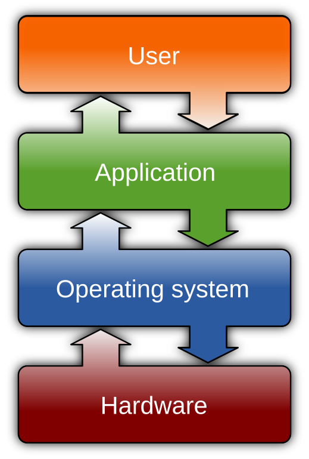

## Overview (TLDR)

Composability is one of those longest and toughest challenges in software, and it doesn't look to me as we have solved it just yet. Industry move to Virtualization and Containerization brought with it many benefits, but also additional overheads that we must keep in mind and analyze. In this part 1 of the series, I recount where we are and how we got here.

## One Ring To Rule Them All

Let us start with the basics. All computers, from large servers to smallest Android phone in your pocket, are running an Operating System. Modern OS does a lot, but my focus today is on execution protection layers.

The CPU has [protection rings](https://en.wikipedia.org/wiki/Protection_ring) - to ensure only OS Kernel and Drivers code have full access to computing resources, while user-space (aka: Apps code) is effectively limited and controlled by the OS. While this arrangement makes a lot of sense, there is immediate overhead in executing Apps when they need to ask OS for "services" - and those arguably happen constantly. Apps need to access network, (many) files, screen and other hardware devices (via drivers) and more! So there is constant overhead for CPU to "switch" between rings, and although it is not as pronounced with Phone Apps, on Servers where every nano-second counts, it is definitely impactful.

## Software Composition

With virtualization we gain extra flexibility to run large variety of software applications, but that not only runs in user-land (except with hypervisors, on that later), but often can introduce translation layer in cases where our simulated hardware is not 100% compatible with actual hardware. On the flip side this has additional security benefits as [VMs](https://en.wikipedia.org/wiki/Virtual_machine) are tightly controlled.

With the introduction of containers we cheered for many benefits from consistent dependencies management, to portability, isolation and even some security. Linux C-Groups, most common mechanism to manage container resources during execution, introduces additional complexity and overheads. 

Most developers today see themselves more as Lego builders - figuring out which small/big blocks to use where, to ensure they fit in an optimal way. Yet almost as soon as the first version of an "App" is released few lego blocks become "obsolete" - and it is VERY challenging to replace them without completely breaking the whole construction down or making it into an Ugly (and usually Unlivable) mess...

## It Is Not My Department

More often than not - developers stay focused on galloping ahead, either not bothering to replace obsolete lego blocks or asking someone else to "allocate time" to do so. Even within the same organization there are often separation of responsibilities in an effort to more efficiently utilize resources. It is one thing to have security department analyze company code once it is ready, or QA team test the deliverables, it is quite another to be potentially block development progress because relevant "department" handling API needed is unresponsive. Sadly as a result companies often end up with kludge workarounds in such cases, further reducing the quality and maintainability of the code.

## Containerized Oil Tanker

Anther interesting approach to analyze this is an Oil Tanker! Lets say we need to transport oil from location to location. The fewer large "containers" we have, the more oil we can fit and the fewer heavy Metal walls/containers we will require. However there are some significant downsides - what if there is some damage to a wall, only single container will spill in such case, rather than entire oil? Or what if we need to move multiple different types of oil?

## Walk the Talk

What I realize is that our journey is more about where we started - with large servers and data centers helping companies large and small organize world's information. As we move into public cloud solutions (aka: Hyperscaler data-centers), we are exploring the best organizational solutions to maximize compute and storage resource utilization.

My sense is that we are yet to figure the "Optimal" end state, perhaps then we can prepare a more solid strategy of how to get from "here" to "there". Meanwhile I say lets enjoy this exploration of combination space together!

## Some further reading to explore

- [Container Runtimes Compared](https://www.wiz.io/academy/container-runtimes)
- [Operating Systems](https://en.wikipedia.org/wiki/Operating_system)
- [System on a Chip](https://en.wikipedia.org/wiki/Protection_ring)
- [History of OLE from Microsoft, early componentization attempts](https://en.wikipedia.org/wiki/Object_Linking_and_Embedding)


**Featured image by me via NightCafe - using Flux Schnell model**

>> Prompt: Large Oil Tanker with some containers on top, with beautiful sunset in the background and few coastal birds in the foreground.
